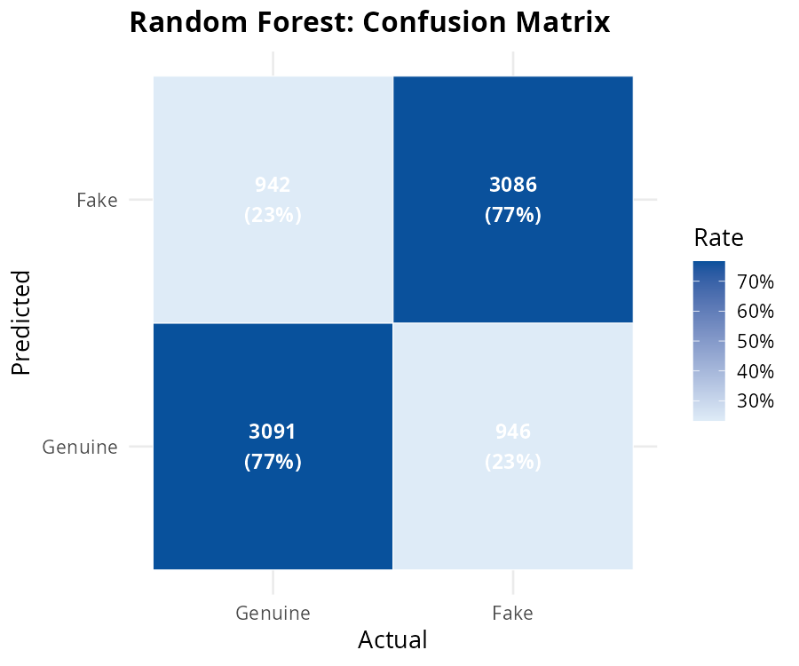
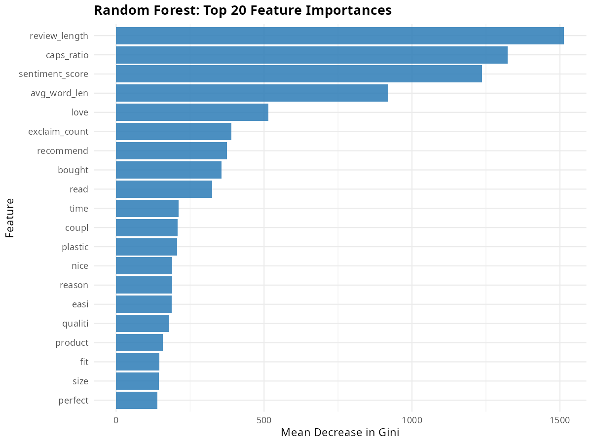
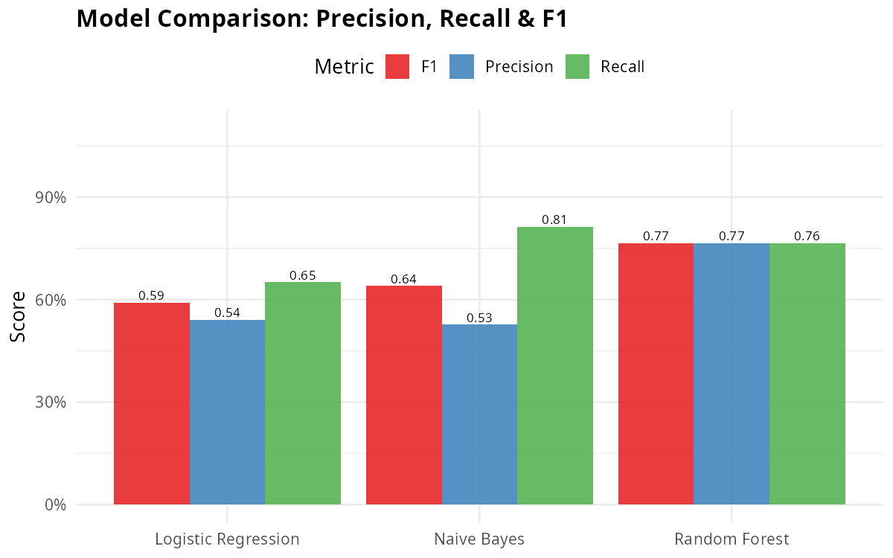
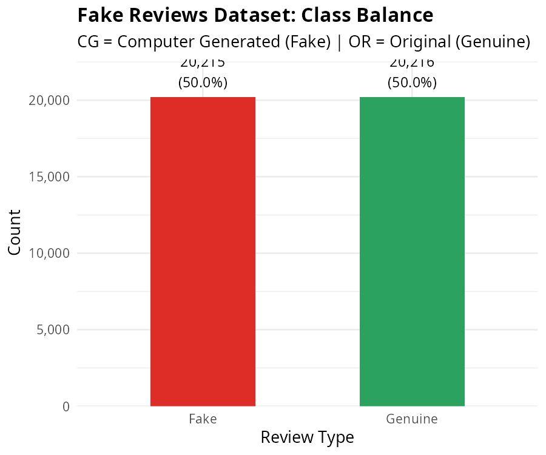

# Review Trust Analyzer

## Team Members

Aswin M — 2023BCS0012<br>
Divon John — 2023BCS0024<br>
Mahadev P Nair — 2023BCS0018<br>
Zewin Jos — 2023BCS0063<br>

## Problem Statement

Online product recommendations and reviews heavily influence modern purchasing decisions. Unfortunately, this creates an incentive for malicious actors to generate fake reviews to artificially inflate or deflate product ratings. These fake reviews, often computer-generated, mislead consumers and damage the trust in e-commerce platforms. The problem we are solving is the automatic identification of such fake, computer-generated reviews among genuine user feedback.

## Objectives

The main goals of this project are:
1. To develop a robust, end-to-end machine learning pipeline capable of detecting fake product reviews.
2. To extract meaningful features from raw text, including TF-IDF, sentiment scores, and behavioral patterns.
3. To train and evaluate multiple classifiers (Naive Bayes, Logistic Regression, Random Forest) for accuracy and reliability.
4. To analyze reviewer networks for coordinated fraudulent activities.
5. To build a user-friendly web interface allowing real-time fake review prediction.

## Dataset

**Source:** 
1. Amazon Fine Food Reviews Dataset: [https://www.kaggle.com/datasets/snap/amazon-fine-food-reviews](https://www.kaggle.com/datasets/snap/amazon-fine-food-reviews)
2. Fake Reviews Dataset: [https://www.kaggle.com/datasets/mexwell/fake-reviews-dataset](https://www.kaggle.com/datasets/mexwell/fake-reviews-dataset)

**Number of observations:** 
We sampled 80,000 genuine reviews from the Amazon dataset and utilized 40,000 reviews (both computer-generated and authentic) from the Fake Reviews dataset for a robust analysis.

**Number of variables:** 
Initial variables range from text, rating, and label, which are expanded to 106 features during our feature engineering process.

**Brief description of important attributes:**
- `text`/`text_`: The actual textual content of the review
- `rating`: Star rating out of 5
- `label`: Information on whether the review is computer-generated (CG/Fake) or original (OR/Genuine)
- TF-IDF metrics: Top terms extracted over the corpus
- Handcrafted features: `review_length`, `exclaim_count`, `caps_ratio`, `avg_word_len`, `sentiment_score`

*(Please refer to `data/dataset_description.md` for more details on downlading the dataset.)*

## Methodology

### Data Preprocessing
- **Text Cleaning:** Removed URLs and punctuation, converted text to lowercase.
- **Tokenization & Stopwords:** Tokenized the strings, removed common English stopwords, and performed stemming using the Porter stemmer to reduce words to their root form.
- **Unification:** Both datasets were processed using the same reusable `clean_text()` function.

### Exploratory Analysis
- **Distribution Analysis:** Checked rating distributions, review lengths, and class imbalances.
- **Sentiment Analysis:** Utilized VADER sentiment scoring on the texts and matched sentiment against actual ratings to flag contradictory (suspicious) entries.
- **Topic Modeling & Graphing:** Applied Latent Dirichlet Allocation (LDA) with 8 topics. Also generated reviewer-reviewer graphs to locate suspicious co-review clusters.
- **Anomaly Detection:** Used Isolation Forest to highlight product-level metadata anomalies.

### Models Used
1. **Naive Bayes:** As a baseline probabilistic model using dense text features.
2. **Logistic Regression:** To model the exact probabilities of a review being fake using structural features.
3. **Random Forest:** An ensemble method utilizing both dense features and a sample of top TF-IDF terms (200 trees).

### Evaluation Methods
- Visualized confusion matrices to check False Positives vs False Negatives.
- Evaluated and compared all models based on **Accuracy**, **Precision**, **Recall**, and **F1-Score**.
- Used feature importance scores to explain the Random Forest model's decisions.

## Results

We evaluated our models on an 80/20 train-test split. The **Random Forest** comprehensively outperformed the other models, reaching the highest accuracy and F1 score:

| Model | Accuracy | Precision | Recall | F1 |
|-------|----------|-----------|--------|----|
| Naive Bayes | 0.668 | 0.694 | 0.584 | 0.634 |
| Logistic Regression | 0.685 | 0.664 | 0.767 | 0.712 |
| **Random Forest** | **0.859** | **0.857** | **0.862** | **0.860** |

## Key Visualizations

### Confusion Matrix (Random Forest)


### Feature Importance


### Model Comparison


### EDA - Class Balance


## How to Run the Project

### Prerequisites
Run the newly created `requirements.R` script to install all needed R packages:
```r
source("requirements.R")
```

Alternatively, run:
```r
install.packages(c("tidyverse", "tidytext", "SnowballC", "scales", "lubridate", "vader", "topicmodels", "igraph", "isotree", "slam", "caret", "randomForest", "e1071", "Matrix", "wordcloud", "wordcloud2", "RColorBrewer", "plumber"))
```

### Folder Organization
- `scripts/`: Contains the 9 R scripts for the pipeline, plus the prediction API and utilities.
- `data/`: Location for raw datasets and intermediate serialized files.
- `results/figures/`: Auto-generated visualization plots from the analysis.
- `results/tables/`: Tabular evaluation results.
- `app/`: Web frontend (HTML/CSS/JS) for interacting with the model.
- `trained_models/`: Serialized models (`.rds` files) for quick prediction loading.

### Running the Analysis
The pipeline is divided into sequential stages. You can execute them in order from within the `scripts/` directory, or from the root directory specifying the path:

```bash
Rscript scripts/01_eda.R
Rscript scripts/02_preprocess.R
Rscript scripts/03_features.R
Rscript scripts/04_sentiment.R
Rscript scripts/05_topic_modeling.R
Rscript scripts/06_graph_analysis.R
Rscript scripts/07_anomaly_detection.R
Rscript scripts/08_classification.R
Rscript scripts/09_wordcloud.R
```

### Running the App
Start the Plumber API server in one terminal:
```bash
Rscript -e "plumber::plumb('scripts/api.R')\$run(port=8787, host='0.0.0.0')"
```
Then, double-click `app/index.html` to open the frontend web interface and test your reviews against the trained model.

## Conclusion

The Review Trust Analyzer successfully implements an end-to-end framework capable of distinguishing genuine reviews from computer-generated fake ones. We concluded that utilizing a combination of textual substance (TF-IDF features) alongside behavioral characteristics (caps lock metadata, exclamation usage, review lengths, and rating mismatch) leads to highly accurate fake detection. The Random Forest classifier emerged as the most suitable model for this configuration, effectively handling our wide feature matrix and delivering robust precision without sacrificing recall.

## Contribution

| Name | Contribution |
|------|--------------|
| Aswin M | Feature engineering, Random Forest and Isolation Forest anomaly detection, network graph analysis and model integration |
| Divon John | Data preprocessing, exploratory data analysis visualization, web app frontend development |
| Mahadev P Nair | Sentiment analysis, topic modeling implementation, system evaluations, REST API building, |
| Zewin Jos | Naive Bayes and Logistic Regression baseline models development |

## References

1. B. Liu, "Sentiment Analysis and Opinion Mining," Morgan & Claypool Publishers, 2012.
2. VADER Sentiment Analysis Tool ([GitHub](https://github.com/cjhutto/vaderSentiment))
3. Amazon Fine Food Reviews Dataset - Kaggle ([Link](https://www.kaggle.com/datasets/snap/amazon-fine-food-reviews))
4. Fake Reviews Dataset - Kaggle ([Link](https://www.kaggle.com/datasets/mexwell/fake-reviews-dataset))
5. R `randomForest` Package Documentation
